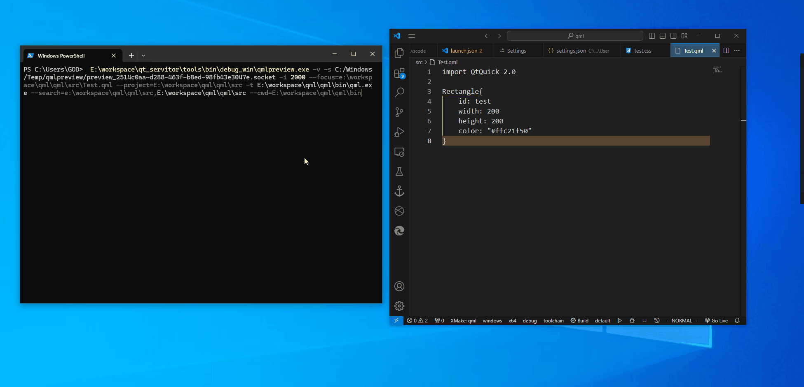

# 介绍

复用 [Qt Creator](https://github.com/qt-creator/qt-creator) 项目基础组件，实现
- `QML` 实时预览工具
- [language server protocol](https://microsoft.github.io/language-server-protocol/specifications/lsp/3.17/specification/) 语言服务。

# 使用

> 相关工具均集成到 `vscode` 插件 [Qt Servitor](https://marketplace.visualstudio.com/items?itemName=TriangleOxO.qtservitor)，可在插件中直接使用。

## qmllsp

```term
triangle@LEARN:~$ qmllsp.exe --help

The tool is a QML Language Server.

Usage: qmllsp [OPTIONS]

Options:
    -?,--help                 Print this help message and exit.
       --version              Display program version information and exit
    -v,--verbose              Print more debug information to `log/qmllsp.log`.
    -p,--port UINT            server port.
       --typeDescription TEXT The `qml-type-descriptions` folder.
       --sdk TEXT             The folder of Qt Sdk.
       --targetFolder TEXT ...
                              The folders including target file. Multiple folders are separated by `,`.
       --qml2imports TEXT ... The `QML2_IMPORT_PATH` folders. Multiple folders are separated by `,`.
       --import TEXT ...      The qml import folders. Multiple folders are separated by `,`.
       --qrc TEXT ...         The `*.qrc` resource files. Multiple folders are separated by `,`.
       --src TEXT ...         The folders including qml source project (e.g. `*.qml`, `.js`,`qmldir`). Multiple folders are separated by `,`.
```

`qmllsp` 遵守 `LSP` 语言服务协议，实现了 `QML` 基本语言特性，包括
- 语法静态检测
- 拾色器
- 智能补全
- 定义跳转
- 变量重命名
- 引用查找
- 格式化

## qmlpreview



```term
triangle@LEARN:~$  E:\workspace\qt_servitor\tools\bin\debug_win\qmlpreview.exe --help

The QML preview tool will listen project files dependent by the Quick application
and refreshe application live with these files change.
Files include *.qml, *.js, *.qrc, qmldir etc.

Usage: qmlpreviewtool [OPTIONS]

Options:
    -?,--help                                     Print this help message and exit.
       --version                                  Display program version information and exit
    -v,--verbose                                  Print more debug information to `log/preview.log`.
       --quiet                                    Print console Message.
       --ignore                                   Turn off refresh preview interface when error or empty file is reloaded successfully.
                                                  If file loading falls into death loop, you should need this.
    -z,--zoom FLOAT:FLOAT in [0.2 - 10] [1]       Display zoom factor.
    -i,--interval UINT:INT in [1000 - 10000] [1000]
                                                  Interval (ms) to update file change.
    -t,--target TEXT                              File path. The target program will be launched for live preview.
       --cwd TEXT                                 The workspace folder of target program.
    -s,--socket TEXT Excludes: --host --port      The socket file of QML debug server.
    -h,--host TEXT [127.0.0.1]  Needs: --port Excludes: --socket
                                                  The host of QML debug server.
    -p,--port UINT:INT in [0 - 65535] [2333]  Needs: --host Excludes: --socket
                                                  The port of QML debug server.
       --qrc TEXT ...                             *.qrc file path. Multiple files are separated by `,`.
       --search TEXT ...                          Extend asset search folder. Multiple folders are separated by `,`.

Group (Required):
These options have to configure.
Options:
       --project TEXT REQUIRED                    Project folder path.
       --focus TEXT REQUIRED                      File path. The primary QML file will be previewed.
```

# 构建

1. **[可选]** 构建 [Qt Creator](https://github.com/qt-creator/qt-creator) 项目。当前项目已经使用 `Qt 6.7.0` 与 `MSVC 2019 x64` 环境得到了基础组件，若需要其他版本组件，可自行构建 Qt Creator 项目，获取以下基础组件
    - AdvancedDockingSystem
    - Aggregation
    - CPlusPlus
    - ExtensionSystem
    - GLSL
    - KSyntaxHighlighting
    - LanguageServerProtocol
    - LanguageUtils
    - libvterm
    - Modeling
    - Nanotrace
    - ProParser
    - QmlDebug
    - QmlEditorWidgets
    - QmlJS
    - QmlPuppetCommunication
    - QrCodeGenerator
    - qtcreatorcdbext
    - qtkeychain
    - Sqlite
    - TerminalLib
    - Tracing
    - Utils
    - winpty

2. 工程目录

    ```txt
    .
    ├── CHANGELOG.md
    ├── README.md
    ├── asset
    ├── bin                     # 编译目标成果
    ├── build
    ├── doc                     # 一些文档
    ├── include
    │   └── qtcreator           # Qt creator 组件库相关头文件
    ├── lib
    │   └── qtcreator           # Qt creator 组件库
    │       ├── debug_win
    │       └── release_win
    ├── src
    │   ├── common              # 公共代码
    │   ├── preview             # qmlpreview 工具项目
    │   └── qmllsp              # qmllsp 语言服务项目
    └── xmake.lua               # xmake 项目编译配置
    ```

3. 工程环境
   - `Qt 6.7.0` 
   - window 编译器 `MSVC 2019 x64`
   - 编译工具 [xmake](https://xmake.io/#/)
   - linux 编译器 [待实现]

